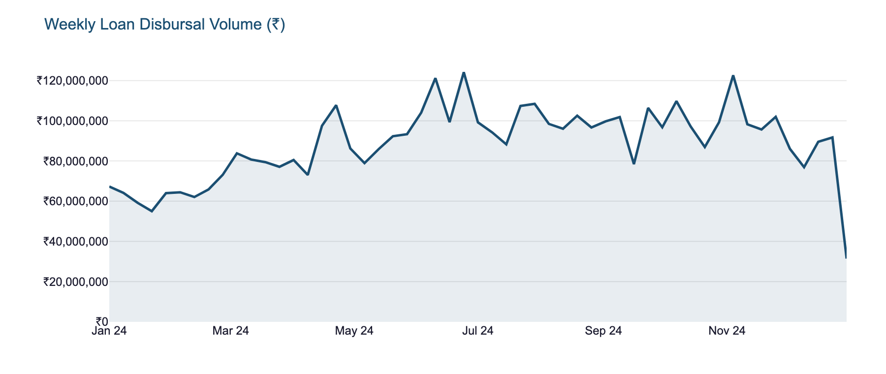
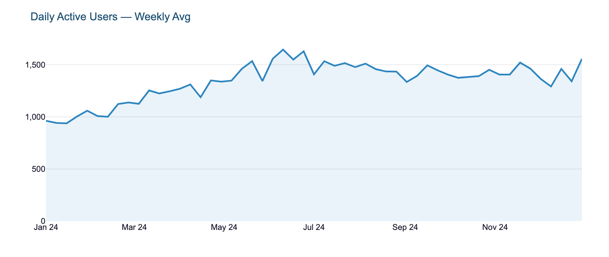
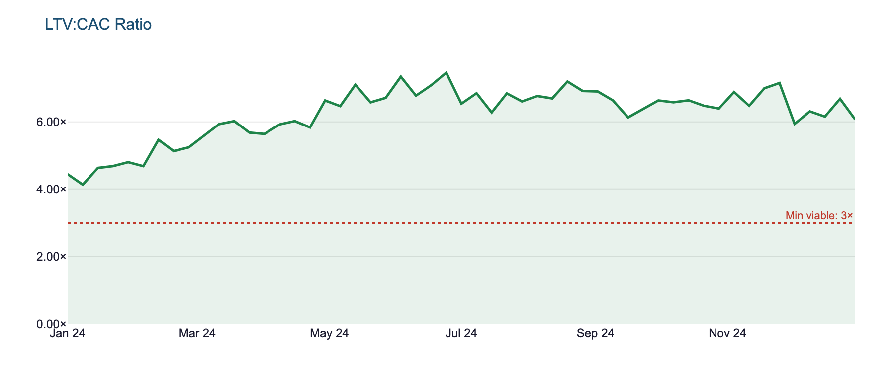
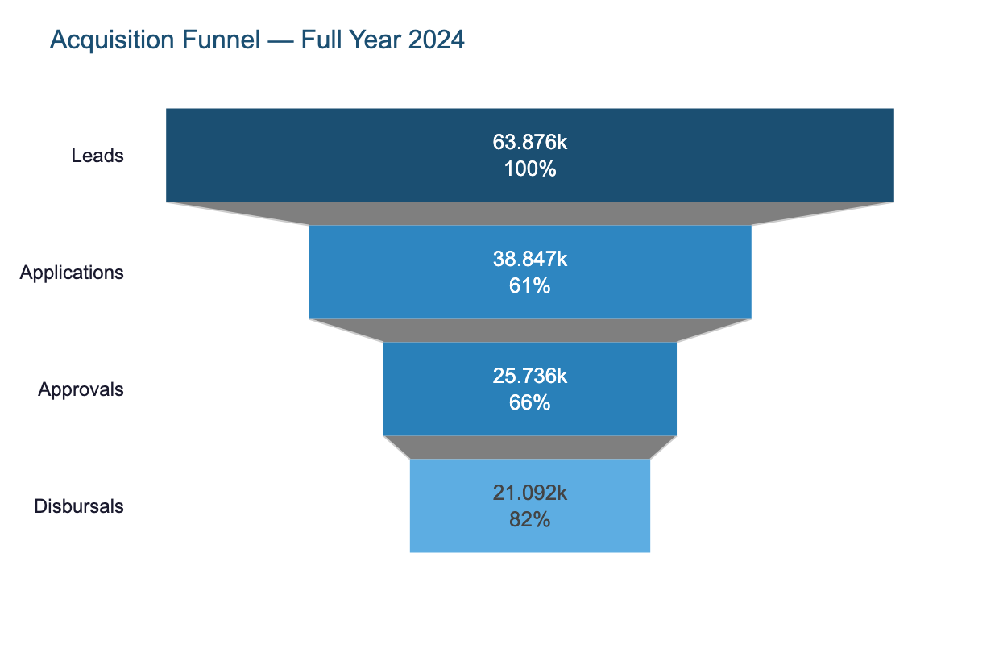
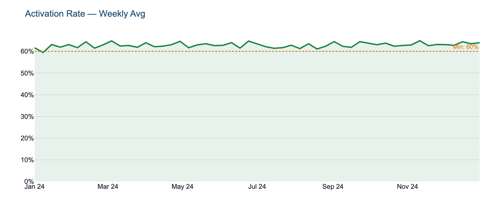
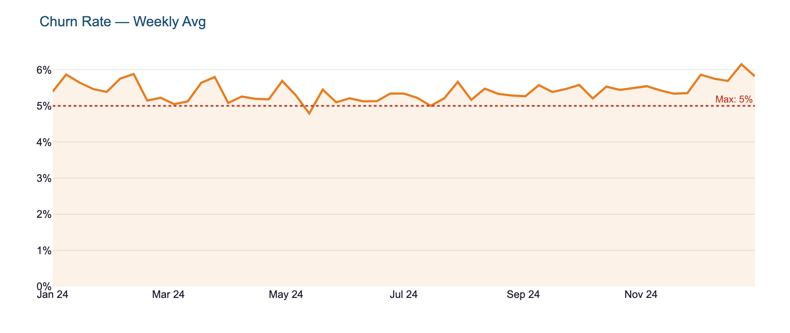
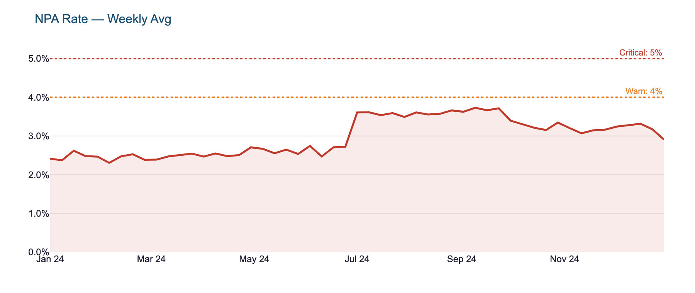
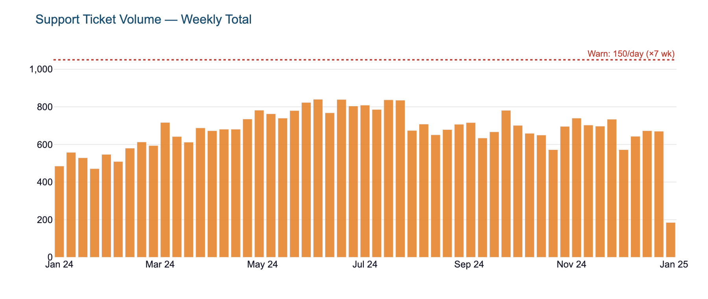
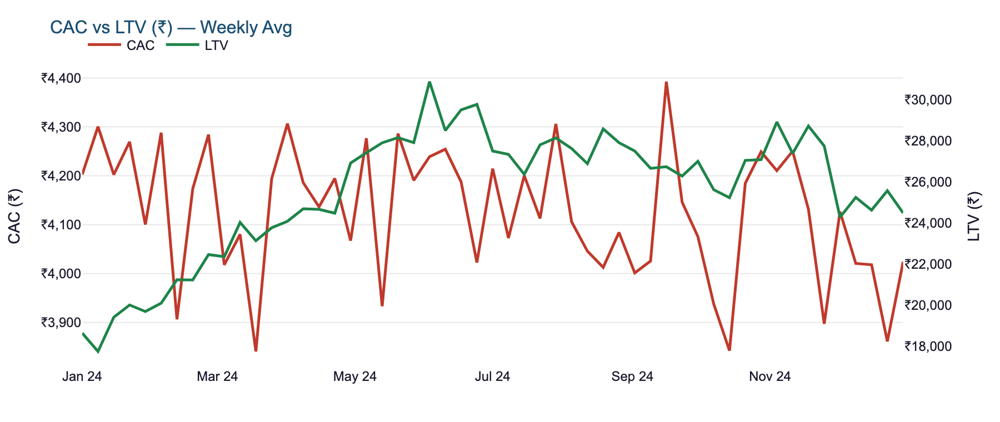

# LendIQ — Live Metrics Dashboard
**Portfolio project · B2B SaaS Lending · India Fintech**

> Demonstrates KPI framework design, metric instrumentation, and "PM-layer" data storytelling
> for a fictional B2B SaaS lending platform targeting SME borrowers in India.

---

## Quick Start

```bash
# 1. Install dependencies
pip install -r requirements.txt

# 2. Generate 12 months of synthetic daily data
python3 generate_data.py

# 3. Launch the dashboard
streamlit run app.py
```
[]

Use the sidebar to switch pages and filter by date range.

---

## Dashboard Preview

### Overview — North Star & Growth Health

The Overview page anchors the entire framework around **Loan Disbursal Volume** — the single number that moves when marketing, underwriting, and ops are all working.

**Weekly Loan Disbursal Volume (₹)**


**Daily Active Users**


**LTV:CAC Ratio** *(threshold: 3× minimum)*


---

### Funnel & Retention

Tracks the full borrower journey from lead to active user. Every stage has a defined conversion threshold and a PM action.

**Acquisition Funnel — Leads → Applications → Approvals → Disbursals**


**Activation Rate** *(threshold: 60% minimum)*


**Churn Rate** *(threshold: 5% maximum)*


---

### Risk Monitor

Guardrail metrics that tell you when growth has outrun underwriting quality or operational capacity.

**NPA Rate** *(warn: 4% · critical: 5%)*


**Support Ticket Volume** *(threshold: 150/day)*


**CAC vs LTV — dual axis**


---

## Metric Framework

### North Star Metric — Loan Disbursal Volume (₹)

**Why this metric?**
In a B2B lending SaaS, disbursals are the moment value is delivered — to the borrower (liquidity), to the lending partner (yield), and to the platform (fee revenue). It is the single number that moves when everything else is working: marketing is reaching the right borrowers, underwriting is approving the right risk, and ops is releasing funds on time.

A DAU or revenue line can be gamed; disbursal volume is hard to fake because it requires real money moving to real accounts.

**What decisions it drives:**
- Growth vs. risk calibration — high volume + rising NPA = false growth
- Channel investment — which acquisition source produces disbursing borrowers?
- Ops capacity planning — KYC and disbursement staffing

---

### Funnel Metrics

| Metric | Definition | Threshold | PM Action |
|---|---|---|---|
| **Leads** | Unique users starting an application | — | Monitor WoW for acquisition health |
| **Applications** | Completed loan application forms | Conversion < 50% | A/B test form UX; check eligibility filter placement |
| **Approvals** | Applications approved by underwriting | Conversion < 60% | Review bureau score cutoffs; check model calibration |
| **Disbursals** | Approved loans with funds released | Conversion < 75% | Ops bottleneck — KYC or bank mandate failures |
| **Activation Rate** | Users completing first loan ÷ signups | < 60% | Onboarding redesign; Day-1 and Day-7 drop-off audit |
| **Churn Rate** | Borrowers inactive 90+ days | > 5% | CS playbook; segment by loan size and repayment history |

**Why these metrics?**
Acquisition without activation is wasted CAC. A funnel view forces the team to distinguish between a marketing problem (leads), a product problem (activation), and an ops problem (disbursal lag).

---

### Unit Economics

| Metric | Definition | Threshold | PM Action |
|---|---|---|---|
| **CAC** | Total acquisition cost ÷ new disbursing borrowers | > ₹4,500 | Channel mix review; pause low-ROI paid channels |
| **LTV** | Projected net revenue per borrower lifetime | < ₹18,000 | Review pricing, repeat loan rate, and default rate |
| **LTV:CAC Ratio** | LTV ÷ CAC | < 3× | Do not scale acquisition until ratio recovers |
| **DAU** | Daily active users (session ≥ 1 min) | > 10% WoW drop | Product engagement audit; push notification A/B test |

**Why LTV:CAC = 3× as the threshold?**
Industry standard for SaaS. Below 3× means you are spending more to acquire a customer than the discounted lifetime value they return — unsustainable at scale regardless of topline growth.

---

### Risk / Guardrail Metrics

| Metric | Definition | Threshold | PM Action |
|---|---|---|---|
| **NPA Rate** | Non-Performing Assets as % of total book | > 4% | Tighten underwriting; pause aggressive acquisition |
| | | > 5% | Escalate to credit committee; potential RBI reporting |
| **Support Ticket Volume** | Daily inbound support tickets | > 150/day | Taxonomy analysis; >40% repayment-related = collections ops issue |

**Why NPA Rate is a guardrail, not the North Star?**
NPA is a lagging indicator — it reflects decisions made 3–6 months ago. Treating it as North Star creates perverse incentives (reject everything to keep NPA low). Instead, use early delinquency (DPD 1–30) as the _leading_ risk signal and NPA as the guardrail that tells you when you've already gone too far.

---

## Data Model

All metrics at **daily granularity** for 2024 (Jan–Dec), 366 rows.
File: `data/lendiq_metrics.csv`

| Column | Type | Description |
|---|---|---|
| `date` | date | Calendar date |
| `loan_disbursal_volume` | ₹ | Total loan value disbursed |
| `leads` | int | Top-of-funnel entries |
| `applications` | int | Completed applications |
| `approvals` | int | Underwriting approvals |
| `disbursals` | int | Funds released |
| `activation_rate` | % | First-loan completion rate |
| `churn_rate` | % | 90-day borrower inactivity rate |
| `cac` | ₹ | Customer Acquisition Cost |
| `ltv` | ₹ | Lifetime Value |
| `ltv_cac_ratio` | ratio | LTV ÷ CAC |
| `dau` | int | Daily Active Users |
| `npa_rate` | % | Non-Performing Asset rate |
| `support_ticket_volume` | int | Daily support tickets |

**Realism assumptions:**
- Weekly seasonality: weekend volumes ~38% of weekday (B2B, SME borrowers operate Mon–Fri)
- Monthly seasonality: Q2 (Apr–Jun) is peak; Dec is slowest
- NPA drifts upward through the year (portfolio aging), spikes in Q3, partially recovers in Q4
- CAC improves MoM as channel mix matures
- All ₹ figures calibrated to a Series-A stage Indian fintech (₹8–25L/day disbursal range)

---

## File Structure

```
LendIQ-Dashboard/
├── app.py                    # Streamlit dashboard (3 pages)
├── generate_data.py          # Synthetic data generator
├── generate_screenshots.py   # Chart PNG export for README
├── data/
│   └── lendiq_metrics.csv    # 366 rows × 14 columns
├── images/                   # Chart screenshots (README assets)
├── requirements.txt
└── README.md
```

---

## Tech Stack

| Component | Tool |
|---|---|
| Data generation | Python, pandas, numpy |
| Dashboard | Streamlit |
| Charts | Plotly |
| Static exports | Plotly + Kaleido |

---

## About This Project

Built to demonstrate:
1. **Metric framework thinking** — not just what to measure, but what decisions each metric drives
2. **Threshold-based alerting** — every KPI has a defined action, not just a number
3. **PM storytelling** — the commentary layer on each page translates data into recommendations
4. **Fintech domain fluency** — NPA, LTV:CAC, activation rates in the context of Indian lending
